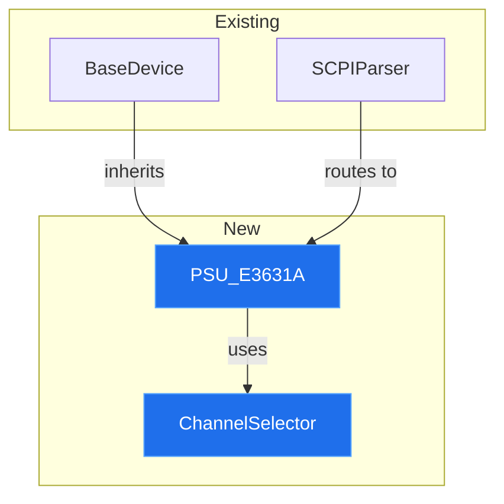

You are generating a consolidated visual report of all changes made
during this overnight session. This is a SESSION-LEVEL view across all
tickets — different from /mr-description, which writes one description
per individual PR.

The output is a single self-contained HTML file the human opens in the
morning to understand everything that changed at a glance, before
diving into individual PR reviews.

This file is written to docs/reports/ which is gitignored. Never commit it.

---

## STEP 1 — GATHER THE SESSION'S BRANCHES

Read the checkpoint to find every branch created this session:

```bash
cat .claude/memory/checkpoint.md 2>/dev/null
```

Extract the completed ticket/issue numbers and their branch names.

If no checkpoint exists, fall back to detecting recent branches:
```bash
# Branches created today, sorted by most recent commit
git for-each-ref --sort=-committerdate refs/heads/ \
  --format='%(refname:short) %(committerdate:short)' \
  | grep "$(date +%Y-%m-%d)"
```

If "$1" was given, report only on that branch or ticket.

---

## STEP 2 — COLLECT DIFF DATA PER BRANCH

For each branch found:

```bash
BRANCH="feature/issue-N-slug"

# Summary stats
git diff main..$BRANCH --stat

# Machine-readable numstat (additions, deletions, filename)
git diff main..$BRANCH --numstat

# Full diff for excerpt selection
git diff main..$BRANCH

# Just the file list with change type (A/M/D)
git diff main..$BRANCH --name-status

# Commit messages on this branch
git log main..$BRANCH --pretty=format:"%h %s"
```

From this, compute per branch:
- Files added / modified / deleted (counts and names)
- Total lines added / removed
- Which directories were touched (src/, tests/, docs/, config)
- New dependencies introduced (check diffs on requirements.txt,
  package.json, CMakeLists.txt, Cargo.toml, go.mod)
- Whether tests were added alongside code (ratio of test files to source files)

---

## STEP 3 — IDENTIFY STRUCTURAL CHANGES FOR DIAGRAMS

Not every change deserves a diagram. Generate a Mermaid diagram only when
the change is structural. Decide by asking:

Generate an architecture diagram when:
- New modules, classes, or components were introduced
- Existing components gained new relationships (new imports, new calls,
  new inheritance)
- Data flow changed between existing parts

Skip the diagram when:
- The change is a single-file bug fix
- Only tests or documentation changed
- The change is purely internal to one function

For structural changes, build a Mermaid `graph TD` showing:
- Existing components in one style
- New components in a highlighted style
- New connections as thicker/labeled edges



Also consider a `sequenceDiagram` when the change adds a new interaction
flow (e.g., a new API call chain, a new event sequence), and a
`stateDiagram-v2` when the change adds or modifies a state machine.

---

## STEP 4 — SELECT ANNOTATED CODE EXCERPTS

For each branch, pick 1-3 excerpts that best explain WHAT changed and WHY.
Do not dump the whole diff — the reader has the PR for that.

Good excerpt criteria:
- The core logic of the change (not boilerplate)
- Something non-obvious that benefits from explanation
- A decision point where an alternative was rejected

For each excerpt, include:
- File path and line range
- The code itself (with +/- markers preserved)
- A one or two sentence explanation of what it does and why it was
  written this way

---

## STEP 5 — WRITE THE HTML REPORT

Write to `docs/reports/session-YYYY-MM-DD.html`.

Requirements:
- Self-contained: all CSS inline, opens with plain file://
- Mermaid via CDN with a graceful fallback (see pattern below)
- Dark theme consistent with the learning docs
- Collapsible sections per ticket
- Responsive tables

### Mermaid with fallback pattern

Mermaid requires internet for the CDN. Always include the raw diagram
source in a collapsed `<details>` so the report is still useful offline.

```html
<script src="https://cdn.jsdelivr.net/npm/mermaid@10/dist/mermaid.min.js"></script>
<script>
  if (window.mermaid) {
    mermaid.initialize({ startOnLoad: true, theme: 'dark' });
  } else {
    document.querySelectorAll('.mermaid').forEach(el => {
      el.innerHTML = '<p class="diagram-unavailable">Diagram requires internet ' +
                     '— see source below</p>';
    });
    document.querySelectorAll('.diagram-source').forEach(el => el.open = true);
  }
</script>
```

### Report structure

```
1. Session Header
   - Date, duration, repo name
   - Tickets attempted / completed / blocked / skipped

2. At-a-Glance Summary Table
   | Ticket | Title | Branch | PR/MR | Files | +Lines | -Lines | Tests Added |

3. Aggregate Stats
   - Total files touched across all tickets
   - Total lines added / removed
   - Directories affected (bar or table breakdown)
   - New dependencies introduced (flag prominently if any)

4. Per-Ticket Sections (collapsible, one per ticket)
   For each:
   a. Ticket title + link to the PR/MR
   b. Mermaid architecture diagram (if structural change)
   c. Files changed table:
      | File | Change | +| -| Why it changed |
   d. 1-3 annotated code excerpts
   e. Test coverage note (were tests added? which ones?)

5. Cross-Cutting Observations
   - Files touched by more than one ticket (conflict risk on merge)
   - Patterns repeated across tickets
   - Anything that looks inconsistent between tickets

6. Review Priority Recommendation
   Ordered list of which PRs to review first and why
   (largest blast radius first, or dependencies first)
```

---

## STEP 6 — FLAG MERGE-ORDER RISK

This is the most valuable analytical output of the report.

Because every branch in an overnight session is cut from the same `main`
snapshot, two tickets that touched the same file will conflict when the
second one merges.

Detect this:
```bash
# Build a map of file -> branches that touched it
for BRANCH in $(list of session branches); do
    git diff main..$BRANCH --name-only | while read f; do
        echo "$f  $BRANCH"
    done
done | sort | uniq -c | sort -rn
```

Any file appearing under more than one branch is a merge conflict risk.
Surface these prominently near the top of the report:

```
⚠ MERGE ORDER MATTERS
src/devices/base_device.py touched by:
  - feature/issue-42-e3631a  (+18 lines)
  - feature/issue-44-dp832   (+12 lines)
Recommendation: merge #42 first, then rebase #44 before merging.
```

If no overlaps exist, state that plainly — "No file overlaps between
branches; PRs can be merged in any order."

---

## STEP 7 — VERIFY IT IS NOT STAGED

The report is local only, same policy as docs/learning/.

```bash
# Ensure docs/reports/ is gitignored
grep -qF "docs/reports/" .gitignore || echo "docs/reports/" >> .gitignore

# Verify nothing got staged
git status --short | grep "docs/reports"
# Must be ?? (untracked). If M or A:
git reset HEAD docs/reports/ 2>/dev/null || true
```

---

## STEP 8 — PRINT THE OPEN COMMAND

```
Session report written:
  docs/reports/session-YYYY-MM-DD.html

Open it:
  macOS:  open docs/reports/session-YYYY-MM-DD.html
  Linux:  xdg-open docs/reports/session-YYYY-MM-DD.html

[N] tickets · [N] files changed · +[N] / -[N] lines
[merge order warning if applicable]
```

---

## WIRING THIS INTO THE OVERNIGHT SESSION

Add to the END OF ALL TICKETS section of overnight-session.md or
overnight-session-jira.md, after /index and before the OVERNIGHT_REPORT:

```
### 1.5 GENERATE THE VISUAL SESSION REPORT (local only)

Run: /diff-report
→ Creates docs/reports/session-YYYY-MM-DD.html

Verify not staged:
  git status --short | grep "docs/reports"
  git reset HEAD docs/reports/ 2>/dev/null || true
```

Then reference it in the morning checklist of OVERNIGHT_REPORT.md:

```
2.5 open docs/reports/session-YYYY-MM-DD.html   ← visual diff overview
```

---

## RELATIONSHIP TO THE OTHER OUTPUTS

| Output | Scope | Purpose |
|--------|-------|---------|
| /mr-description | One PR | The PR body a reviewer reads on GitHub/GitLab |
| /diff-report (this) | Whole session | Visual overview of everything, read first in the morning |
| OVERNIGHT_REPORT.md | Whole session | Text status: what completed, blocked, skipped |
| /teach + /drill-me | One ticket's concept | Learning materials from the diff |
| /index | All learning docs | Home page linking lessons and drills |

Read order in the morning:
1. OVERNIGHT_REPORT.md — what happened
2. docs/reports/session-*.html — what changed, visually
3. Individual PRs — line-by-line review
4. docs/learning/index.html — study what was built
