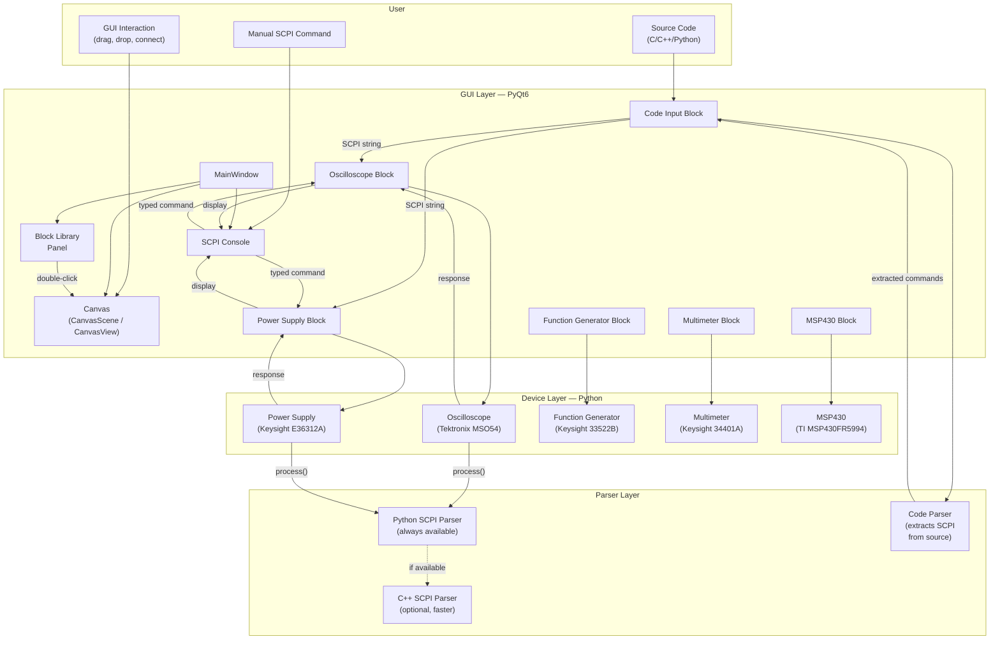
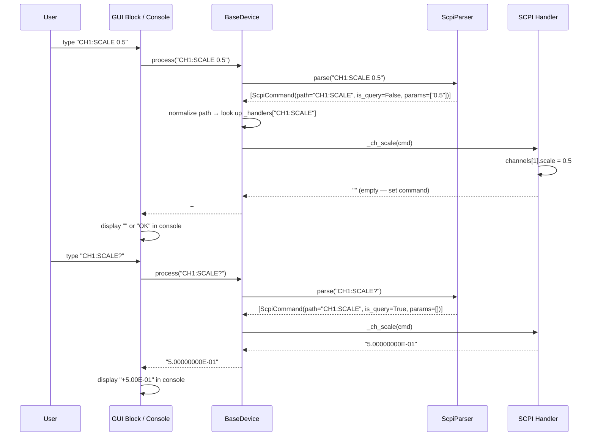
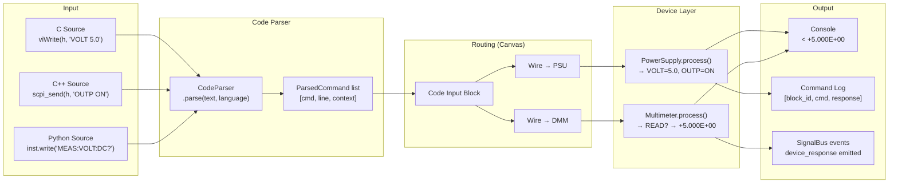
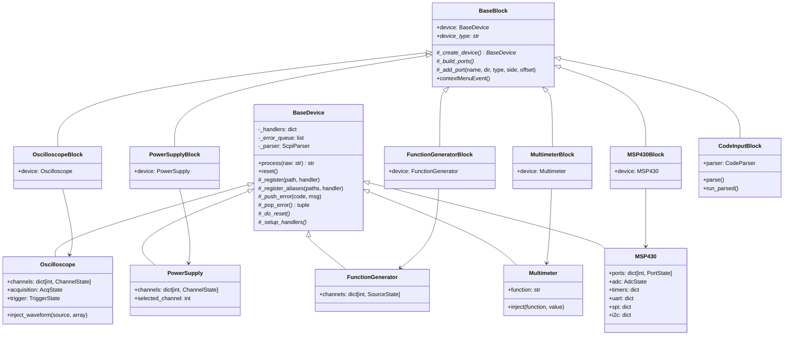
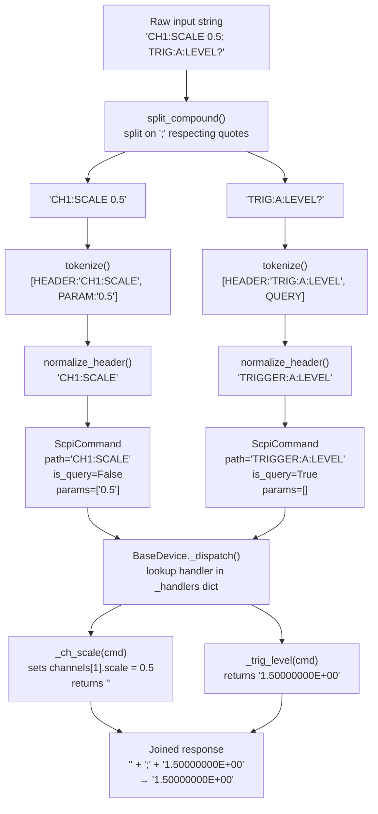
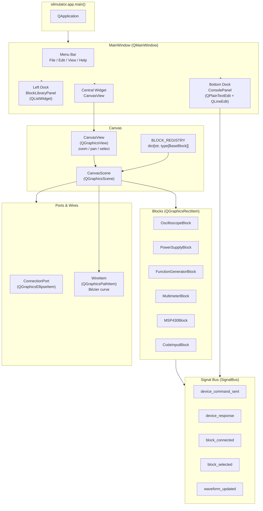
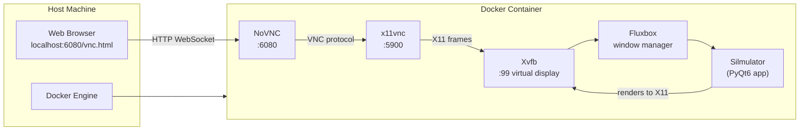
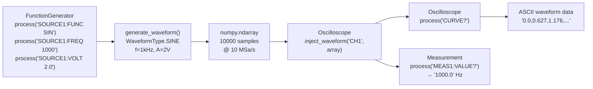

# Silmulator Architecture & Diagrams

This document provides conceptual diagrams of how Silmulator works, from
user code input all the way to virtual instrument responses.

All diagrams use [Mermaid](https://mermaid.js.org/) syntax and can be rendered in
GitHub, GitLab, VS Code (with the Mermaid extension), or any Mermaid-compatible viewer.

---

## 1. System Overview

---

## 2. SCPI Command Lifecycle

---

## 3. Data Flow: Code → Blocks → Output

---

## 4. Class Hierarchy

---

## 5. SCPI Parser Internals

---

## 6. GUI Architecture

---

## 7. Docker Deployment

---

## 8. Waveform Signal Chain

---

*Silmulator v1.0.0 — architecture diagrams*
