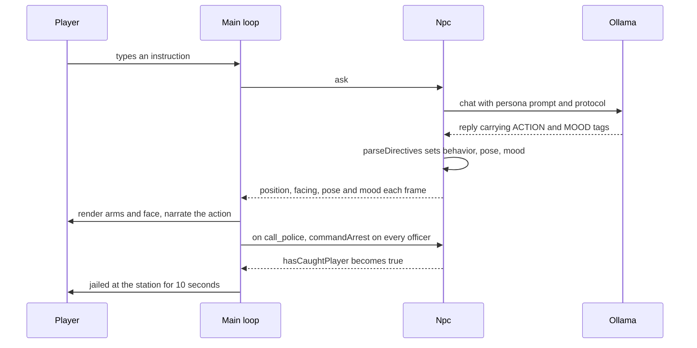

## Summary

NPCs can now be *instructed* and *react emotionally*. Tell any resident to
follow you, wave, raise a hand, or face you and they'll actually do it; insult,
compliment, or surprise them and their words and face respond. Only police can
arrest — civilians instead flag down an officer, who chases you and hauls you
to the station for a short sentence. The character models gained arms and
expressive faces so all of this is visible in the world, and a long-standing
bug that mirrored every NPC's facing direction is fixed.

## Changes by File

**`src/core/NpcAction.hpp`** — added
The heart of the feature: defines the `NpcAction` vocabulary (follow, stop,
face, raise_hand, wave, arrest, call_police, plus internal return_home) and the
`NpcMood` set, and implements `parseDirectives()` — a tolerant parser that pulls
`[[ACTION: x]]` / `[[MOOD: y]]` tags out of an LLM reply. It copes with the mess
a small model actually emits: tags anywhere in the text, single- or
double-bracket forms, duplicates (last mood wins), and synonym words
(`annoyed`→angry, `flattered`→happy, …). All recognized-looking tags are
stripped so brackets never reach the on-screen transcript.

**`src/core/Persona.hpp`** — modified
Adds a `police` flag and rewrites the appended system-prompt protocol. The
prompt is now persona-aware (police get the `arrest` directive; everyone else
gets `call_police`), teaches the model to treat `*asterisk*` text as player
emotes, instructs warn-then-escalate handling of disruptive players, and
mandates a mood tag on every reply.

**`src/core/Npc.hpp` / `src/core/Npc.cpp`** — modified
NPCs gained world behavior. `onReplyArrived()` now parses directives and sets
movement behavior, a timed gesture pose, and a decaying mood. `update(dt,
playerPos, city)` ticks that behavior each frame — following/chasing via the
existing `City::resolveMovement` collision slide, facing the player, returning
home, and expiring gestures/moods. Adds `commandArrest()`, `commandReturnHome()`,
and `lookAt()` so the main loop can drive police, plus the police-gating rule
that converts a civilian's `arrest` into `call_police`.

**`src/core/PersonaLoader.cpp`** — modified
Parses the new `police = true` header key (required, since the loader rejects
unknown keys).

**`personas/cop.persona`** — modified
Marks Officer Dana Brooks as `police = true` — the only resident who can arrest.

**`src/app/Renderer3D.hpp` / `src/app/Renderer3D.cpp`** — modified
Fixes the facing bug (`glRotatef(-facing…)` → `glRotatef(facing…)`, which had
mirrored every NPC in X) and adds two new bits of geometry: arms that pivot at
the shoulder for raise-hand/wave poses, and a face (eyes, brows, mouth, blush)
whose shape follows the NPC's mood. `NpcVisual` carries the new pose and face
inputs.

**`src/app/main.cpp`** — modified
Wires it together: ticks every NPC each frame (frozen by the pause menu),
narrates actions as transcript stage directions (so a wordless tag-only reply
still reads), turns an NPC to face you when a chat opens, routes a `call_police`
summons to every officer, maps mood→face for rendering, and implements the
jail — on capture the player is teleported to the station, movement locks for
10s with an on-screen countdown, and the arresting officer walks back to post.

**`tests/test_npc_action.cpp` / `test_npc_behavior.cpp` / `test_persona.cpp`** — modified
Cover the new business logic: directive parsing (placement, bracket forms,
synonyms, stripping), follow/arrest/face/return-home movement convergence, mood
decay, civilian→call_police conversion, and the police-gated prompt.

### Minor / build
**`tests/Makefile`** — added `-MMD -MP` header-dependency tracking; an `Npc`
layout change had previously left stale objects that failed with ABI
mismatches.

## Why

The game's premise is live LLM characters, but until now they could only *talk*
— they were static props. Letting the model emit structured action/mood tags
turns conversation into behavior and expression without any new I/O: it rides
the existing chat round-trip. Tags are the right altitude because the model
already produces text; the work is making the parser robust to a 3B model's
sloppiness rather than assuming clean output.

Compliance is intentionally left to the model (a cop may arrest, a baker
refuses) so behavior stays in-character and emergent. The one place we *don't*
trust the model is authority: arrest is gated in code, not just in the prompt,
so a civilian can never chase the player even if the model emits the wrong tag —
they call the police instead. Faces and arms are deliberately simple textured
boxes (no asset pipeline, matching the existing procedural-geometry style)
because the goal is legible expression at a distance, not fidelity.

The facing fix shipped here because it was the same renderer code the gestures
touched, and the bug (every NPC mirrored in X) made "face me" turn the wrong
way — it was one sign flip against the documented coordinate convention.

## Testing

- `make -C tests test` — full offline suite: **75 test cases, 511 assertions,
  all passing** (1 skipped: the live-Ollama test). 22 of these are new.
- `cmake --build build -j` — clean build of the SFML/OpenGL game target.
- Headless end-to-end checks against the real local Ollama (qwen2.5:3b-instruct)
  with the real persona prompts confirmed in-character tag emission: "I love
  you"→embarrassed, "you suck"→angry, "I like your hat"→happy, `*shouts*`→an
  in-character warning, and police arrest gating.
- Manual in-game runs for the facing fix, gestures, faces, and the
  call-police→chase→jail flow.

## Risk and Rollback

Blast radius is contained to the NPC/dialogue/render layer; no save format,
network protocol, or build-system contract changes (the `tests/Makefile` tweak
is additive). The persona file format gained one optional key. The 7 commits
are independent and revert cleanly; the lowest-level dependency is
`NpcAction.hpp`, so reverting the whole branch is `git revert 1b15976..HEAD` or
simply not merging.

## Diagram

## Checklist
- [x] Tests pass locally (75 cases / 511 assertions)
- [x] No new compiler errors (clean cmake build)
- [x] Player-facing behavior documented in this description
- [ ] No breaking changes (persona format gained one optional key — non-breaking)
